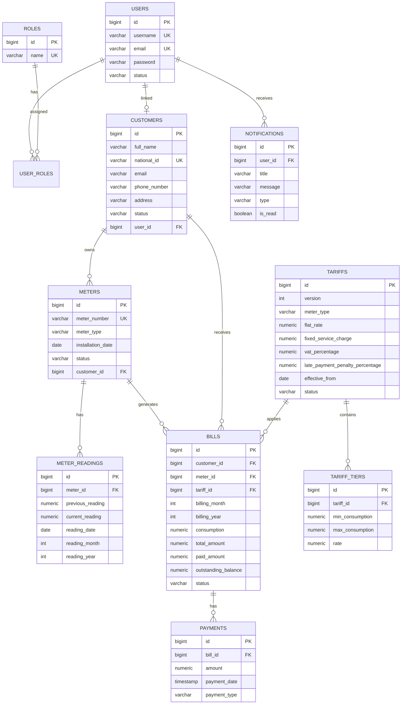

# Utility Billing System - Architecture Documentation

## Architecture Decisions

The backend follows **Clean Architecture** with clear separation of concerns:

| Layer | Responsibility |
|-------|----------------|
| **Controller** | HTTP routing, validation, authorization annotations |
| **Service** | Business logic, transactions, orchestration |
| **Repository** | Data access via Spring Data JPA |
| **DTO** | API request/response contracts |
| **Entity** | JPA domain model mapped to PostgreSQL |
| **Security** | JWT authentication, role-based access control |
| **Exception** | Global error handling with consistent responses |

**Key design choices:**
- **Constructor injection only** — no field injection
- **Flyway migrations** — versioned schema + PostgreSQL triggers
- **Tariff versioning** — new versions only affect future bills via `effective_from`
- **JWT stateless auth** — Bearer token with role claims
- **Dual bill/payment sync** — application services + DB triggers for consistency

---

## Folder Structure

```
utility-billing-system/
├── docs/
│   └── ARCHITECTURE.md
├── src/main/java/com/utility/utility_billing_system/
│   ├── UtilityBillingSystemApplication.java
│   ├── config/
│   │   ├── DataInitializer.java
│   │   └── OpenApiConfig.java
│   ├── controller/
│   │   ├── AuthController.java
│   │   ├── BillController.java
│   │   ├── CustomerController.java
│   │   ├── MeterController.java
│   │   ├── MeterReadingController.java
│   │   ├── NotificationController.java
│   │   ├── PaymentController.java
│   │   ├── TariffController.java
│   │   └── UserController.java
│   ├── dto/
│   │   ├── auth/
│   │   ├── bill/
│   │   ├── common/
│   │   ├── customer/
│   │   ├── meter/
│   │   ├── notification/
│   │   ├── payment/
│   │   ├── reading/
│   │   ├── tariff/
│   │   └── user/
│   ├── entity/
│   │   ├── BaseEntity.java
│   │   ├── Bill.java, Customer.java, Meter.java
│   │   ├── MeterReading.java, Notification.java
│   │   ├── Payment.java, Role.java, Tariff.java
│   │   ├── TariffTier.java, User.java
│   ├── enums/
│   ├── exception/
│   ├── mapper/
│   │   └── EntityMapper.java
│   ├── repository/
│   ├── security/
│   │   ├── CustomUserDetails.java
│   │   ├── CustomUserDetailsService.java
│   │   ├── JwtAuthenticationFilter.java
│   │   ├── JwtProperties.java
│   │   ├── JwtService.java
│   │   └── SecurityConfig.java
│   └── service/
├── src/main/resources/
│   ├── application.properties
│   └── db/migration/
│       ├── V1__init_schema.sql
│       └── V2__triggers.sql
└── pom.xml
```

---

## Entity Relationship Diagram (ERD)



---

## Database Schema Summary

| Table | Purpose |
|-------|---------|
| `roles` | ROLE_ADMIN, ROLE_OPERATOR, ROLE_FINANCE, ROLE_CUSTOMER |
| `users` | System users with credentials and status |
| `user_roles` | Many-to-many user-role mapping |
| `customers` | Customer profiles with unique national_id |
| `meters` | Utility meters linked to customers |
| `meter_readings` | Monthly consumption readings (unique per meter/month/year) |
| `tariffs` | Versioned pricing with effective dates |
| `tariff_tiers` | Tier-based rate slabs |
| `bills` | Generated monthly bills |
| `payments` | Partial and full payment records |
| `notifications` | In-app notifications |

---

## PostgreSQL Triggers

### 1. `trg_generate_bill_on_reading`
- **Fires:** AFTER INSERT on `meter_readings`
- **Action:** Auto-generates a bill when customer and meter are ACTIVE
- **Rules:** Skips if bill already exists; uses effective tariff version

### 2. `trg_update_bill_on_payment`
- **Fires:** AFTER INSERT on `payments`
- **Action:** Recalculates paid/outstanding amounts and updates bill status
- **Rules:** Sets status to PAID when outstanding = 0; creates notification

---

## API Endpoints

| Method | Endpoint | Roles |
|--------|----------|-------|
| POST | `/api/auth/signup` | Public |
| POST | `/api/auth/login` | Public |
| CRUD | `/api/users/**` | ADMIN |
| CRUD | `/api/customers/**` | ADMIN, OPERATOR |
| CRUD | `/api/meters/**` | ADMIN, OPERATOR |
| POST/GET | `/api/meter-readings/**` | ADMIN, OPERATOR |
| CRUD | `/api/tariffs/**` | ADMIN, FINANCE |
| GET/POST | `/api/bills/**` | ADMIN, FINANCE, OPERATOR |
| POST/GET | `/api/payments/**` | ADMIN, FINANCE, OPERATOR |
| GET | `/api/notifications/**` | All authenticated |

**Swagger UI:** `http://localhost:8080/swagger-ui.html`

---

## Setup

1. Create PostgreSQL database:
   ```sql
   CREATE DATABASE utility_billing_db;
   ```

2. Update `application.properties` with your DB credentials.

3. Run the application:
   ```bash
   ./mvnw spring-boot:run
   ```

4. Flyway applies schema and triggers on startup.

5. Register admin via `/api/auth/signup` with role `ROLE_ADMIN`.
